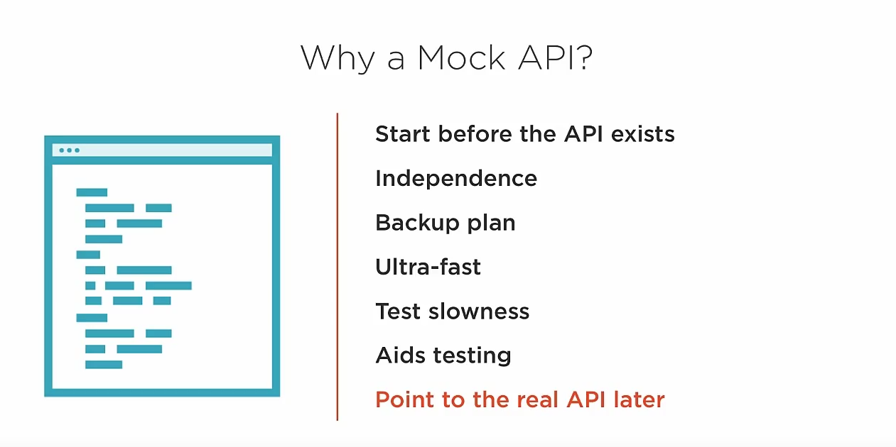
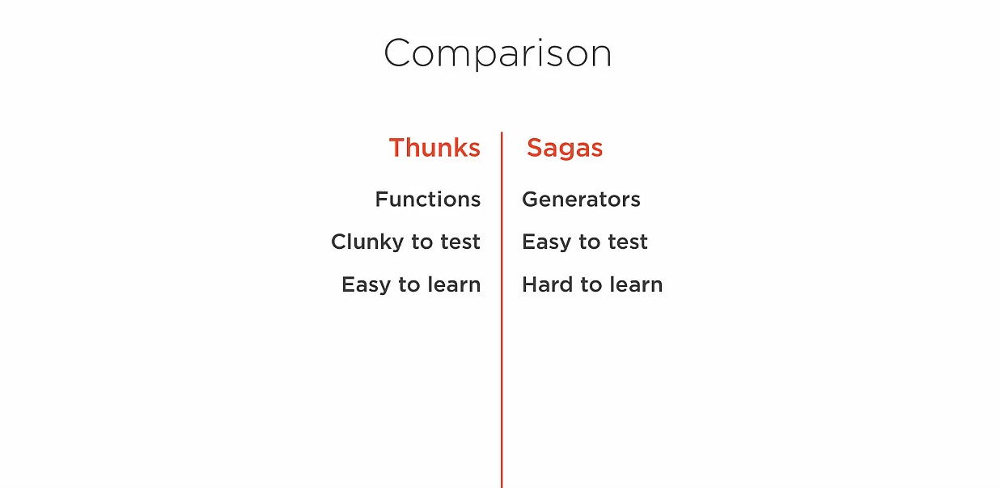

# SUMMARY NOTES ABOUT IDEAS OF USING ASYNC IN REDUX 

## Introduction
Here is the plan:

- **Why a mock API?**
- **Async libraries**
- **Implement Thunks**

### Why a Mock API?


### Redux Async Libraries
- **redux-thunk**: Return functions from action creators.
- **redux-promise**: Flux standard actions and promises.
- **redux-saga**: Uses ES6 generators and rich domain-specific language.



#### Thunks Overview
```javascript
export function deleteAuthor(authorId) {
    return dispatch => {
        return AuthorApi.deleteAuthor(authorId).then(() => {
            dispatch(deleteAuthor(authorId));
        }).catch(handleError);
    };
}
```
