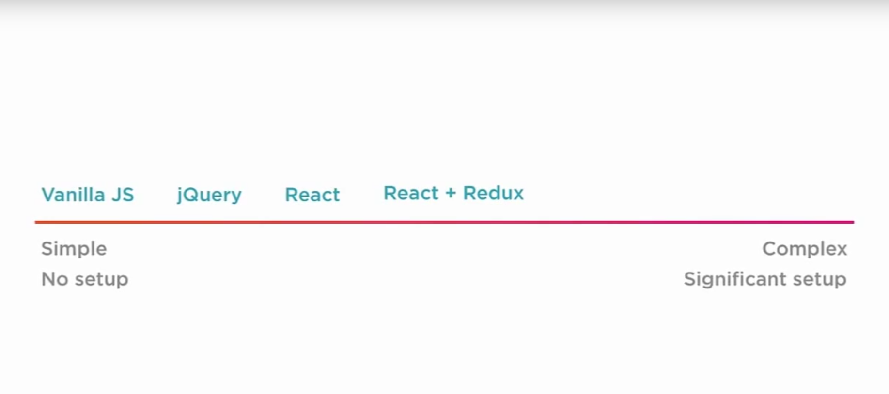
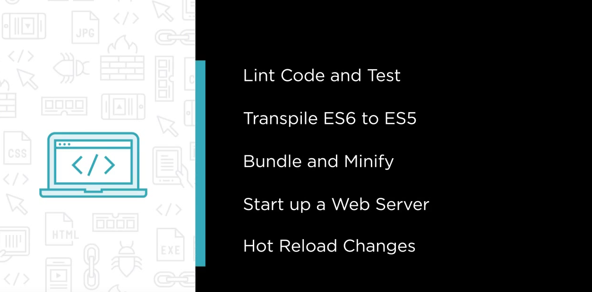
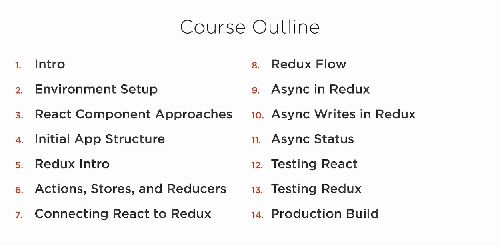
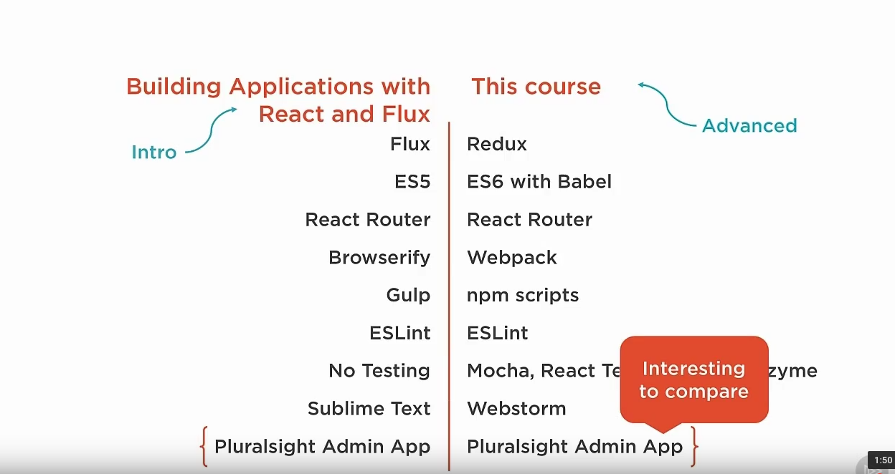
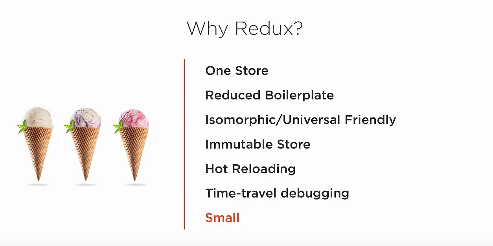

# COURSE OVERVIEWS
## #JavaScriptFatigue

Can you build something big, complicated, interactive, and testable with it?

## Course Outline

## How Is This Course Different From The React and Flux course

## Why Redux?

