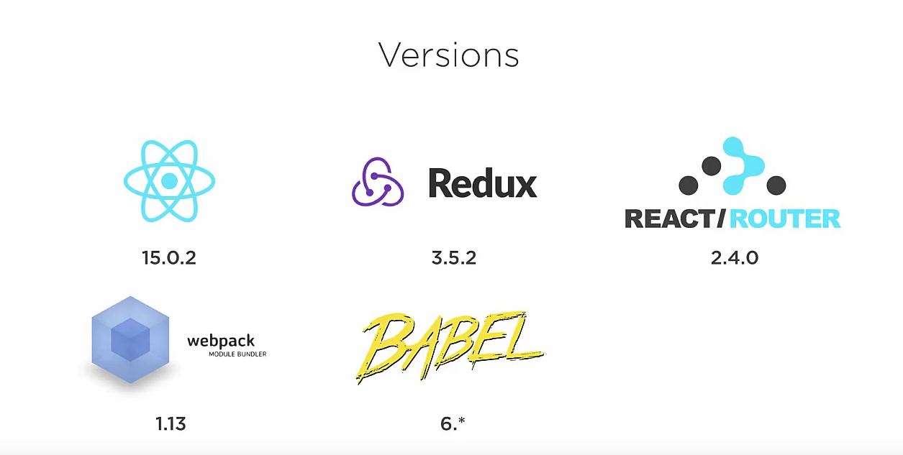

# ENVIRONMENT OVERVIEW
## Summary
- [**React**](https://facebook.github.io/react): React is a javascript library for building user interfaces.
- [**Redux**](http://redux.js.org): Redux is a predictable state container for JavaScript apps.
- [**Babel**](https://babeljs.io): Babel is a JavaScript compiler.
- [**Webpack**](https://webpack.github.io): Webpack is a module bundler. 
- [**Mocha**](https://mochajs.org): Mocha is a feature-rich JavaScript test framework.
- [**ESLint**](http://eslint.org): ESLint is the pluggable linting utility for JavaScript and JSX.

## Babel

Babel is a JavaScript compiler. 
Babel has support for the latest version of JavaScript through syntax transformers. These plugins allow you to use new syntax, right now without waiting for browser support. 
[Read more details](https://babeljs.io)
This course will focus [babel-polyfill](https://babeljs.io/docs/usage/polyfill).

## Webpack

Webpack is a **build tool that puts all of your assets, including Javascript, images, fonts, and CSS, in a dependency graph.** Webpack lets you use require() in your source code to point to local files, like images, and decide how they're processed in your final Javascript bundle, like replacing the path with a URL pointing to a CDN.

**Should I Use Webpack?**

If you're building a complex Front End™ application with many **non-code static assets** such as CSS, images, fonts, etc, then yes, **Webpack will give you great benefits.**

If your application is fairly small, and you don't have many static assets and you only need to build one Javascript file to serve to the client, then **Webpack might be more overhead than you need.**

## Mocha

Mocha is a feature-rich JavaScrispt test framework running on Node.js and in the browser, making asynchronous testing simple and fun. Mocha tests run serially, allowing for flexible and accurate reporting, while mapping uncaught exceptions to the correct test cases.
 
## ESLint

 
ESLint is a tool for identifying and reporting on patterns found in ECMAScript/JavaScript code, with the goal of making code more consistent and avoiding bugs. In many ways, it is similar to JSLint and JSHint with a few exceptions:

- ESLint uses [Espree](https://github.com/eslint/espree) for JavaScript parsing.
- ESLint uses an AST to evaluate patterns in code.
- ESLint is completely pluggable, every single rule is a plugin and you can add more at runtime.
